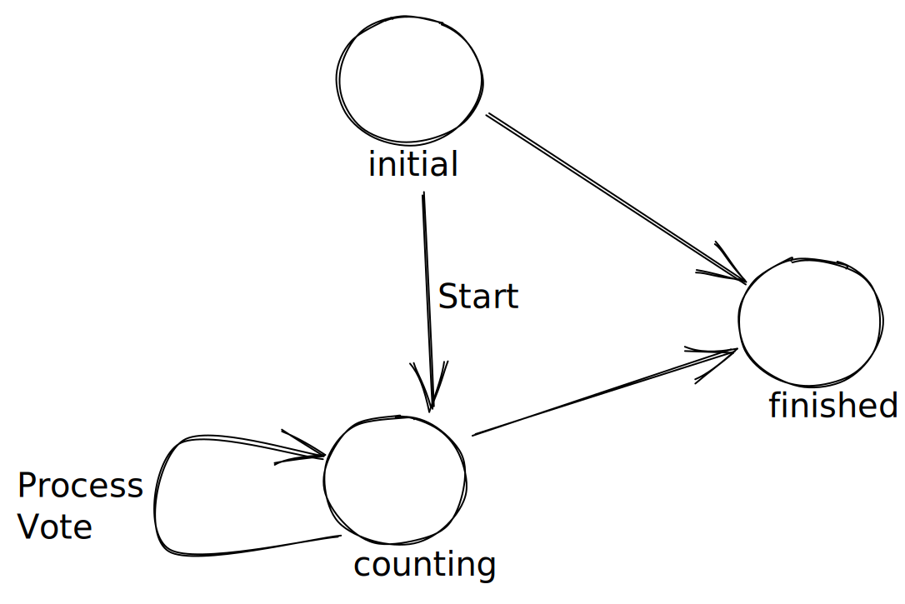

# My approach

I flip flopped on my approach a few times so I wanted to document it here to show thought process.  

## Phase I - EZ mode

The first step was to write tests for the Plurality Election trivial cases to satisfy basic criteria such as:

- 0 candidates,  0 votes - No Winner
- 1 candidate, 1 voter - Candidate wins
- Tie - I implemented this by returning a static instance of Candidate called NoWinner to check against (I prefer this to null checks everywhere.)

The code to do this ended up being a simple linq statement but then I had to add checks for tie conditions and some other things inside the election.  This felt like coupling the election to the 
counting algorithm a bit too closely. 

My next thought was to use a simple state machine to iterate the votes and count them one by one and  transition into different states depending on the votes / stage of the election. However with the votes and candidates this involved passing around too much state (too much state in my State!) and also feel it would lead to an overly complex state machine with a lot of conditionals.

State machine would be better for an actual voting machine's internal programming :) I went so far as to start diagramming one:

## Phase II - Strategy Pattern

Ultimately this felt like a good place to implement a strategy.  The counting strategies can be tested independently and switched out easily in an election rather than re-creating the entire election class to modify an algorithm slightly.  This also let me separate some of the validation done in the election from the algorithm.

Update: I initially added the IBallotCountingStrategy as a requirement in the Run() method of election but found myself mocking it in tests that didn't use it (kind of a code smell) so I've implemented a default strategy for each election with a method on IElection to override it. 

In Program.cs I added a new strategy that does a tie breaker with a random coin toss (though with 3+ candidates that is a strange looking coin.) No requirement was listed for tie breaking scenarios so I either return NoWinner or toss a coin.

### Election Abstract class.
Both election types now inherit from base Election, which has generic parameters for Ballot and Strategy.  Strategy is constrained to a list of the right Ballot types.

My main reason for this was not to repeat myself. I had the shared validation code in two classes and repeated test code and didn't like it. 

### Performance ###
With more time I'd probably tweak the performance in the TryAgain and AdjustBallots methods. Running the program on the command line, I can see the two plurality scenarios are < 100ms whereas the ranked choice is in the 700ms range.   Given n candidates, 100000 votes, and assuming no tie is found until the n-th iteration, it's doing n x 100000 x 3 iterations so O(n) complexity if my CS isn't rusty. 

Update: Wrote the above, then decided to take write a little better performing strategy.

---
# Requirements
In this solution you will find a base project dealing with Political Elections 

The main goal is to implement the business logic for both election types: Plurality & Ranked Choice. 

For Plurality, the candidate with the most votes wins. There is no minimum vote threshold. 

With Ranked Choice, you will need to consider multiple votes per ballot and their respective ranks.

# Technical
This library was created in Visual Studio 2022 using net6.0 (LTS). If this is an issue, let us know and we can send you what ever project version you need.

# Reference
Please feel free to use any resources necessary to craft your solution. Here are some good election references:

- https://en.wikipedia.org/wiki/Plurality_voting
- https://ballotpedia.org/Ranked-choice_voting_(RCV)
- https://fairvote.org/our-reforms/ranked-choice-voting/

# Refactoring
Feel free to clean up project structure, modify any existing classes, use your favorite patterns, etc.

# Questions?
If you have any questions at all about the requirements, reach out any time and we can go over it.
